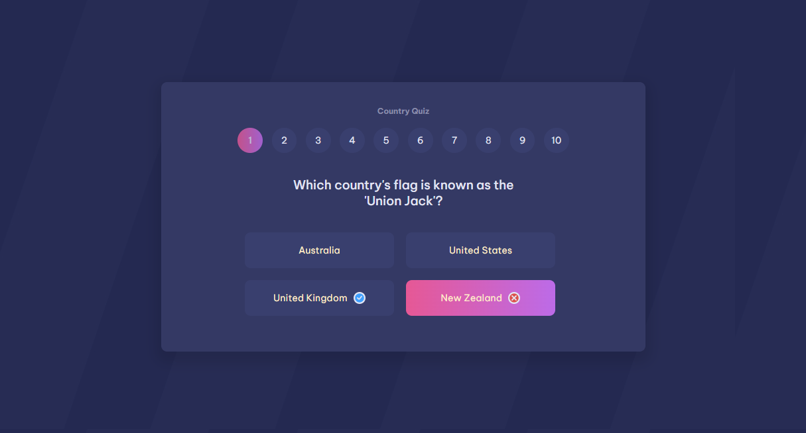

# 🌍 Country Quiz Application

This is a solution to the [Country Quiz application challenge on devChallenges](https://devchallenges.io/editor/solution/24850). devChallenges challenges help you improve your coding skills by building realistic projects. 
This is a simple country quiz application built with HTML, CSS, and JavaScript. The application displays a series of questions about different countries, and the user must select the correct answer from multiple choices.

## Table of contents

- [Overview](#overview)
  - [The challenge](#the-challenge)
  - [Screenshot](#screenshot)
  - [Links](#links)
- [My process](#my-process)
  - [Built with](#built-with)
  - [Features](#features)
  - [What I learned](#what-i-learned)
  - [Continued development](#continued-development)
  - [Useful resources](#useful-resources)
- [Author](#author)
<!-- - [Acknowledgments](#acknowledgments) -->

## Overview

### The challenge

Build a simple country quiz application built with HTML, CSS, and JavaScript.

Users should be able to:

- View multiple-choice questions about various countries
- Receive instant feedback on correct and incorrect answers
- See the correct answer if they select the wrong one
- View the optimal layout for the interface depending on their device's screen size
- See hover and focus states for all interactive elements on the page
- **Bonus**: See the score at the end of the quiz and have an option to play again

### Screenshot

### Links

- Solution URL: 🔗[ Solution](https://github.com/sash-84/devChallenges.git)
- Live Site URL: ➡️[ Live Site](https://sash-84.github.io/devChallenges/Country-Quiz/index.html)

## My process

### Built with

- Semantic HTML5 markup
- CSS custom properties
- Flexbox
- CSS Grid

### Features 

- 📝 Multiple choice questions about various countries
- ✅ Instant feedback on correct and incorrect answers
- ✔️ Display of correct answer upon wrong selection
- 📊 Score tracking
- 🔄 Play again option to restart the quiz

### What I learned

Throughout the development of the Country Quiz app, I gained valuable insights and acquired new skills, including:

During the development of the Country Quiz app, I acquired several key skills:

- 🔄 **Dynamic content rendering**: I learned to dynamically load quiz questions and options using JavaScript.
- 🎯 **Event handling**: Managing user interactions and updating the UI in response to user actions.
- 🔄 **State management**: Tracking user progress, updating scores, and enforcing quiz rules.
- 💬 **Feedback mechanisms**: Providing real-time feedback to users based on their quiz responses.
- 🎨 **CSS styling and animations**: Enhancing the UI with creative styling techniques and animations.
- 📂 **Project organization**: Maintaining a clean and organized codebase using version control tools like Git.

### Continued development

While working on the Country Quiz app, I identified several areas for further improvement:

- ♿ **Accessibility**: Enhancing accessibility features to ensure the quiz is usable by a diverse audience.
- 📱 **Responsive design**: Optimizing the app layout for various screen sizes and devices to improve the user experience.
- 🛠️ **Code efficiency**: Refactoring code to improve performance and maintainability, including reducing redundancy and optimizing algorithms.
- ➕ **Enhanced features**: Adding new features such as user authentication, leaderboard, or additional quiz modes to increase engagement.
- 🧪 **Testing**: Implementing comprehensive testing strategies to identify and fix bugs, ensuring a seamless user experience.

### Useful resources

- [devChallenges](https://devchallenges.io/) - This helped me for layout and design, color schemes and background-images and svgs.
- [MDN WEb Docs](https://developer.mozilla.org/en-US/) - This is an amazing documentation for learning purpose. I'd recommend it to anyone still learning various concept.

## Author

<!-- - Website - [Add your name here](https://www.your-site.com) -->
- devChallenges - [Sakshi Katale](https://developer.mozilla.org/en-US/)
